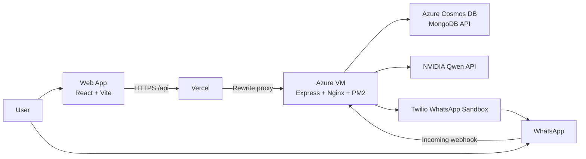

# AutoTask

AI-powered task automation platform with natural-language task parsing, WhatsApp reminders, and a split cloud deployment built for real-world usage.


## Live Demo

- Production app: https://autotask.yaswanthsai.tech

## Overview

AutoTask combines a React frontend, an Express API, AI-assisted task extraction, and Twilio WhatsApp messaging to let users create, manage, and complete reminders from both the web app and chat.

The project is designed around a production split deployment:

- Frontend on Vercel
- Backend on an Azure VM behind Nginx and PM2
- Database on Azure Cosmos DB using the MongoDB API
- WhatsApp messaging through the Twilio sandbox

## Core Capabilities

- Secure authentication with JWT and bcrypt
- Task CRUD with pending, completed, and missed states
- Recurring reminders for daily, weekly, and monthly schedules
- Natural-language task extraction powered by NVIDIA-hosted Qwen
- WhatsApp bot flow for creating tasks and marking reminded tasks as done
- Daily schedule generation and timed reminder delivery
- Per-user timezone-aware scheduling logic
- Production-ready split deployment for frontend and backend

## Architecture



## Tech Stack

| Layer | Technology |
| --- | --- |
| Frontend | React 18, Vite, Tailwind CSS, React Router |
| Backend | Node.js, Express |
| Database | Azure Cosmos DB with MongoDB API |
| AI | NVIDIA API with Qwen 2.5 Coder 32B Instruct |
| Messaging | Twilio WhatsApp Sandbox |
| Scheduling | node-cron |
| Auth | JWT, bcryptjs |
| Deployment | Vercel, Azure VM, Nginx, PM2 |

## Repository Structure

### Top-Level Layout

| Path | Purpose |
| --- | --- |
| `client/` | React frontend application |
| `server/` | Express API, business logic, scheduling, and integrations |
| `deploy/` | Deployment scripts and server provisioning assets |
| `.env.example` | Environment variable template for backend setup |
| `vm-start.ps1` | Start the Azure VM from PowerShell |
| `vm-stop.ps1` | Deallocate the Azure VM to save compute cost |

### Source Map

```text
autotask/
|-- client/
|   |-- src/
|   |   |-- components/        Reusable UI building blocks
|   |   |-- context/           Auth state and shared client state
|   |   |-- pages/             Route-level screens
|   |   |-- services/          API client integration
|   |   |-- App.jsx            Client routing shell
|   |   |-- main.jsx           React entry point
|   |   `-- index.css          Global styles and design tokens
|   |-- vercel.json            Production API rewrite rules for Vercel
|   `-- vite.config.js         Local dev server and proxy configuration
|
|-- server/
|   |-- config/                Database connection setup
|   |-- controllers/           Route handlers for auth, tasks, AI, WhatsApp
|   |-- middleware/            Auth and error handling middleware
|   |-- models/                Mongoose schemas
|   |-- routes/                Express route definitions
|   |-- services/              AI parsing, Twilio messaging, scheduler logic
|   |-- utils/                 Shared helpers such as timezone-aware date logic
|   `-- server.js              Express bootstrap and API wiring
|
|-- deploy/
|   |-- setup-vm.sh            Azure VM bootstrap script
|   |-- nginx.conf             Reverse proxy configuration
|   |-- ecosystem.config.js    PM2 process configuration
|   |-- deploy.sh              Deployment helper script
|   `-- DEPLOYMENT.md          Deployment notes
|
|-- .env.example
|-- package.json
|-- vm-start.ps1
`-- vm-stop.ps1
```

### Backend Layer Breakdown

| Folder | Responsibility |
| --- | --- |
| `server/controllers` | Request handling and orchestration |
| `server/routes` | HTTP route registration |
| `server/services` | Integration-heavy logic such as AI parsing, Twilio, and cron jobs |
| `server/models` | User and task persistence models |
| `server/middleware` | Authentication and centralized error handling |
| `server/utils` | Shared helpers reused across controllers and services |

### Frontend Layer Breakdown

| Folder | Responsibility |
| --- | --- |
| `client/src/pages` | Login, signup, dashboard, tasks, and profile screens |
| `client/src/components` | Forms, cards, layout, navigation, and task widgets |
| `client/src/context` | Client-side auth state |
| `client/src/services` | HTTP communication with the backend |

## Application Flow

### Web App Flow

1. User signs in from the Vercel-hosted frontend.
2. Frontend sends API requests through Vercel rewrite rules.
3. Azure VM processes requests through Express controllers and services.
4. Task data is stored in Azure Cosmos DB.

### WhatsApp Flow

1. User sends a message to the Twilio WhatsApp sandbox.
2. Twilio forwards the webhook to the backend.
3. Backend validates the user by phone number.
4. AI parses the message into structured task data.
5. Task is saved and the confirmation is sent back through Twilio.

## Local Development

### Prerequisites

- Node.js 18+
- npm
- Azure Cosmos DB account or MongoDB Atlas
- NVIDIA API key
- Twilio account with WhatsApp sandbox enabled
- ngrok if you want to test WhatsApp webhooks locally

### Install

```bash
git clone https://github.com/yaswanthsaiyelisetty/autotask.git
cd autotask
npm run install:all
```

### Configure Environment

Copy the backend template and fill in your credentials:

```bash
cp .env.example server/.env
```

Key backend variables:

| Variable | Purpose |
| --- | --- |
| `NODE_ENV` | Runtime mode |
| `PORT` | Express server port |
| `MONGO_URI` | MongoDB or Cosmos DB connection string |
| `AZURE_COSMOS` | Toggle Cosmos-specific behavior |
| `JWT_SECRET` | JWT signing secret |
| `JWT_EXPIRES_IN` | Token lifetime |
| `NVIDIA_API_KEY` | AI parsing and scheduling summaries |
| `TWILIO_ACCOUNT_SID` | Twilio account identifier |
| `TWILIO_AUTH_TOKEN` | Twilio auth token |
| `TWILIO_WHATSAPP_NUMBER` | Sandbox sender number |
| `CLIENT_URL` | Allowed frontend origin for the backend |

### Run Locally

```bash
npm run dev
```

This starts:

- Frontend on `http://localhost:5173`
- Backend on `http://localhost:5000`

### Local WhatsApp Testing

Expose the backend with ngrok:

```bash
ngrok http 5000
```

Then configure the Twilio sandbox webhook to:

```text
https://your-ngrok-url.ngrok-free.app/api/whatsapp/webhook
```

## Production Deployment

### Current Deployment Model

- Frontend: Vercel at https://autotask.yaswanthsai.tech
- Backend: Azure VM
- Reverse proxy: Nginx
- Process manager: PM2
- Database: Azure Cosmos DB

### Deployment Assets in This Repo

| File | Purpose |
| --- | --- |
| `deploy/setup-vm.sh` | Base VM provisioning |
| `deploy/nginx.conf` | Nginx reverse proxy config |
| `deploy/ecosystem.config.js` | PM2 app definition |
| `deploy/deploy.sh` | Deployment helper |
| `deploy/DEPLOYMENT.md` | Deployment notes |
| `vm-start.ps1` | Start Azure VM |
| `vm-stop.ps1` | Stop and deallocate Azure VM |

## Available Scripts

### Root

| Command | Description |
| --- | --- |
| `npm run dev` | Start frontend and backend in development |
| `npm run build` | Build the frontend |
| `npm run start` | Start the backend in production mode |
| `npm run install:all` | Install root, server, and client dependencies |

### Client

| Command | Description |
| --- | --- |
| `npm run dev` | Start Vite dev server |
| `npm run build` | Build the production bundle |
| `npm run preview` | Preview the production build locally |

### Server

| Command | Description |
| --- | --- |
| `npm run dev` | Start Express with nodemon |
| `npm run start` | Start Express normally |

## API Surface

| Area | Endpoints |
| --- | --- |
| Auth | `/api/auth/signup`, `/api/auth/login`, `/api/auth/me`, `/api/auth/profile` |
| Tasks | `/api/tasks`, `/api/tasks/today`, `/api/tasks/stats`, `/api/tasks/:id`, `/api/tasks/:id/complete` |
| AI | `/api/ai/parse` |
| WhatsApp | `/api/whatsapp/webhook` |

## Example WhatsApp Commands

- `Remind me to submit the report tomorrow at 10 AM`
- `Pay electricity bill every month on 1st at 9 AM`
- `done`

## License

MIT
